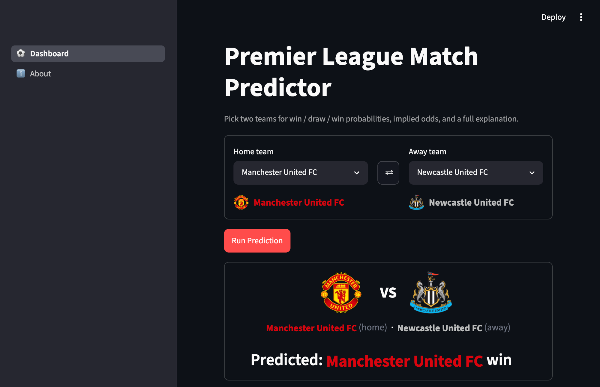
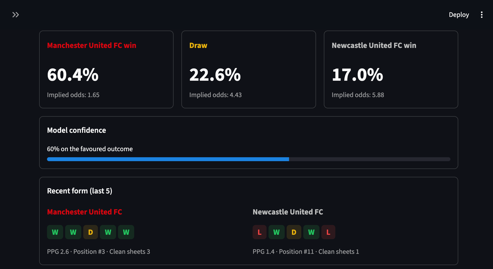
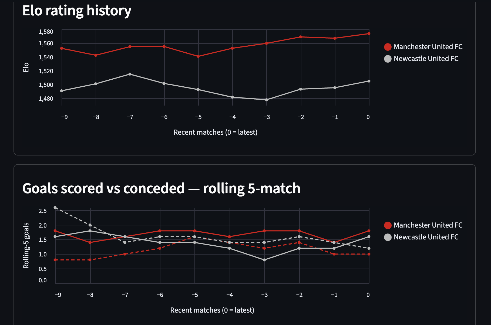
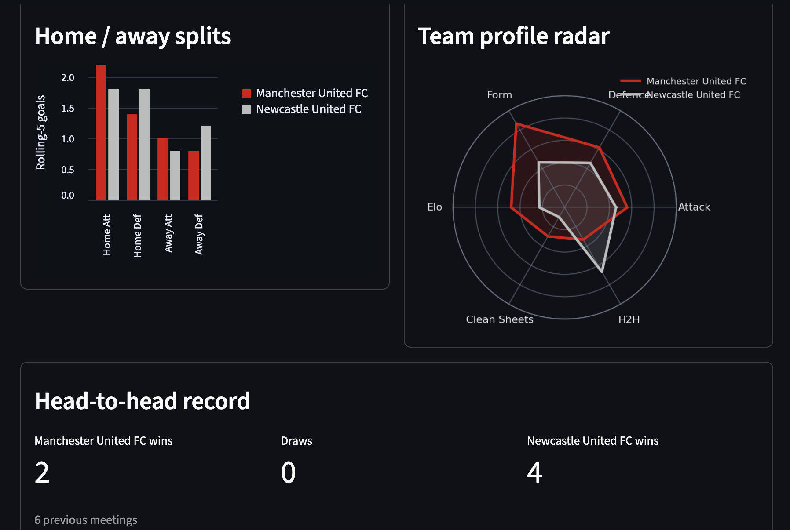
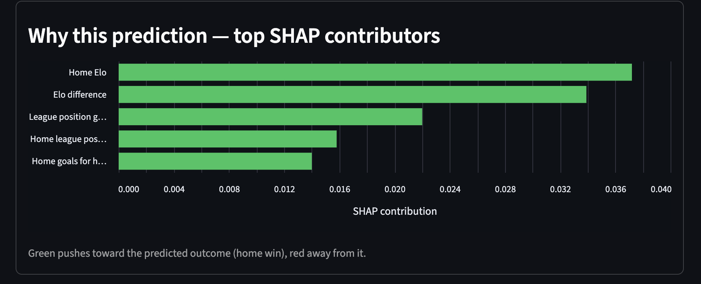
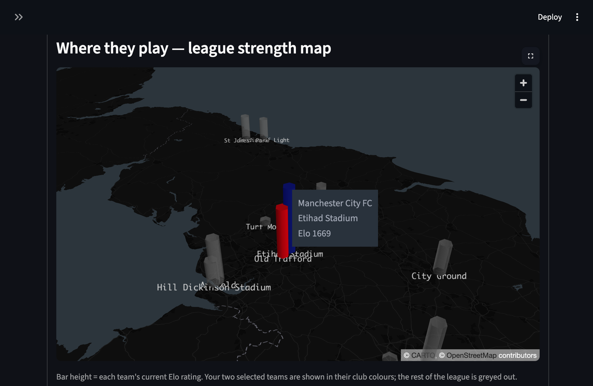

## Project Organization

```
├── README.md          <- Public README: UI URL, stack, run/deploy steps
├── requirements.txt   <- Pinned dependencies
│
├── data
│   ├── raw            <- Immutable match pulls from Football-Data.org
│   ├── processed      <- Canonical dataset + validation reports
│   └── quarantine     <- Dropped/malformed rows from ingest validation
│
├── artifacts          <- Trained models + locked feature schema + tuning/freshness JSONs
│
├── docs               <- Design docs required by the DoDs (schemas, Elo config, etc.)
│
├── reports            <- Backtest outputs: metrics, predictions, model comparison, plots
│
├── references         <- Planning docs
│   ├── Project_User_Stories.md   <- MASTER source of truth (all user stories)
│   └── sprint1..4/               <- Per-story files grouped by sprint
│
├── notebooks          <- Personal scratch / exploration (not part of the pipeline)
│
├── scripts            <- Operational scripts: smoke tests, scheduled refresh+retrain
│
├── tests              <- Pytest suite, mirrors src/
│
└── src                <- Source code
    ├── config.py      <- Paths, PL competition code, Football-Data settings
    ├── ingest         <- Data pipeline: pull, unify, build canonical, validate
    ├── features       <- Leakage-safe feature engineering: rolling, Elo, build_features
    ├── models         <- Training + baselines: Elo, logistic regression, Random Forest, tuning
    ├── backtest       <- Walk-forward backtesting engine
    ├── api            <- FastAPI service: predict, inference features, match context, SHAP
    ├── ui             <- Streamlit dashboard
    └── services       <- External API clients (Football-Data.org)
```

## Run the app locally

The app is a Streamlit dashboard talking to a FastAPI backend. Run them in two terminals.

```
pip install -r requirements.txt

# Terminal 1 — API (http://localhost:8000, docs at /docs)
uvicorn src.api.main:app --reload

# Terminal 2 — dashboard (http://localhost:8501)
streamlit run src/ui/app.py
```

Pick a home and away team, click **Run Prediction**, and you'll get win / draw / win
probabilities, implied odds, the predicted outcome, and a full explanation panel: recent form,
Elo rating history, rolling goals, home/away splits, a team radar, head-to-head, model confidence,
per-prediction SHAP contributions, and a 3D stadium map. Every chart is served by the API —
nothing is hardcoded.

## Screenshots

**Pick two teams and run the prediction** — club crests, brand colours, and a swap button:



**Outcome probabilities, implied odds, model confidence, and recent form:**



**Elo rating history and rolling goals** (solid = scored, dashed = conceded):



**Home/away splits, team profile radar, and head-to-head record:**



**Why this prediction** — the top SHAP features driving the result (green toward, red away):



**League strength map** — each stadium as a 3D bar (height = current Elo), the selected pair in
club colours and the rest of the league greyed out:



## Regenerate artifacts

One command retrains the shipped model and regenerates every artifact the API serves from:

```
python -m src.models.save_artifacts
```

This trains the chosen model (the tuned Random Forest) on the full leakage-safe feature
matrix and overwrites:

- `artifacts/chosen_model.pkl` — the served model
- `artifacts/feature_schema.json` — locked feature contract (columns, dtypes, preprocessing)
- `artifacts/feature_importances.json`
- `artifacts/current_elo.json` — latest Elo ratings used to build inference features